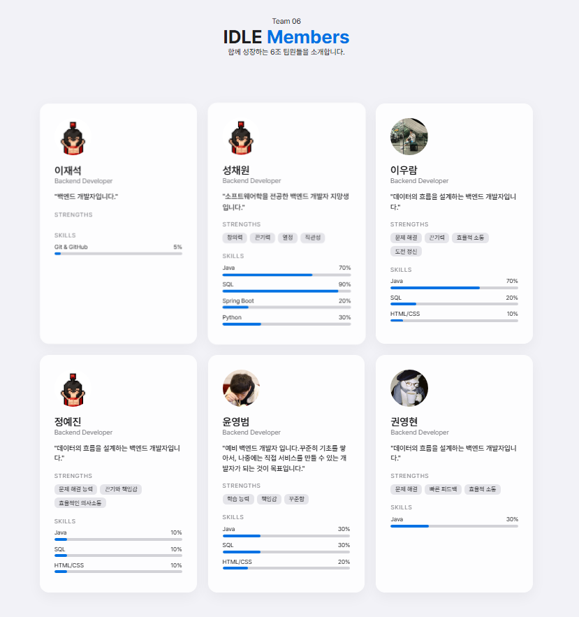

# 팀원 소개 페이지

팀원들의 자기소개를 정리하는 페이지입니다.
각 팀원이 멤버파일 작성하고 PR을 통해 추가합니다.


## [6조] 아이(I)들
[자기소개 페이지](https://w00lam.github.io/idle-lab/)

| 이름  | 역할 | 구현                       |
|:----|:---|:-------------------------|
| 이우람 | 리더 | 레포 생성 및 관리와 README.md 작성 |
| 성채원 | 팀원 | 프론트 개발 및 멤버카드 작성         |                
| 정예진 | 팀원 | 멤버카드 작성                  |
| 권영현 | 팀원 | 멤버카드 작성                  |
| 이재석 | 팀원 | 멤버카드 작성                  |
| 윤영범 | 팀원 | 멤버카드 작성                  |

## TODO list

- 필수 기능
- [x] 우리 팀 저장소 복제 (Clone) & 계획 짜기
- [x] 나만의 작업 공간 만들기 (Branch)
- [x] Markdown으로 자기소개 작성하기
- [x] "제 작업 다 끝났어요!" (Pull Request, PR)
- [x] 팀원의 작업 검토하고 합치기 (Code Review & Merge)

- 도전 기능
- [x] Markdown 소개를 HTML/CSS/JS 페이지로 확장하기
- [x] PR 설명 더 자세히 작성하기

---

## 목표

이 레포지토리는 **팀원 소개 페이지를 관리**하기 위한 공간입니다.

- 각 팀원은 자신의 소개 파일을 마크다운 파일로 작성합니다.
- 작성된 파일은 `/members` 폴더에 저장됩니다.
- PR을 통해 팀원과 피드백을 주고받습니다.

---

## 구조

```bash
idle-lab/
├── index.html               # 팀원 목록 페이지
├── script.js                # JavaScript 파일
├── style.css                # CSS 파일
├── members/                 # 팀원 정보 JSON 파일 디렉토리
│   ├── jaeseok.json         # 팀원 목록 파일
│   ├── seongchaewon.json    # 팀원 목록 파일
│   ├── woolam.json          # 팀원 목록 파일
│   ├── yejin.json           # 팀원 목록 파일
│   ├── yeongbeom.json       # 팀원 목록 파일
│   ├── younghyun.json       # 팀원 목록 파일
│   └── example.json         # 예시 팀원 정보
└── image/                   # 이미지 파일 디렉토리
```

---

## 작성 방법

1. 팀장이 만든 레포지토리를 clone합니다.
2. `/members/` 폴더에 자신의 소개 파일을 생성합니다.

- `members/{name}.md`
- 예시: `members/woolam.md`

3. 업로드 할 이미지가 있다면 `/image` 폴더에 저장합니다.
4. 아래 템플릿을 사용하거나 직접 작성합니다.

```markdown
0. 대표 이미지

1. 경력&경험
   🎯 관심 도메인
   | (예시) 핀테크, 커머스, 고가용성 아키텍처, 데이터 엔지니어링 등

   🚀 기존 경험 (실무/프로젝트)
   | 어떤 경험이던 좋아요! 내가 해왔던 것 중에 공유하고 싶은 것을 얘기해주세요:)

   [프로젝트 명/회사 명] (202X.XX - 202X.XX)
   주요 역할: (예: API 설계 및 DB 최적화)
   성과: (예: 응답 속도 30% 개선, 배포 자동화 구축)
   🛠 기술 스택
   | 없어도 괜찮아요! 가지고 있다면 작성해주세요

   Main: (예: Java, Spring Boot, MySQL)
   Sub: (예: Python, Redis, Docker)
   Learning: (예: Go, Kubernetes)

2. 자기 소개
   🧠 MBTI

   💬 나만의 소통 방식
   |

   ⏰ 에너지 가동 시간 (Work-Log)

   [ ] 🌅 얼리버드 엔진 (오전 집중형: 해 뜨면 코딩 시작)
   [ ] ☀️ 미드데이 부스터 (낮 시간 집중형: 점심 먹고 최고조)
   [ ] 🌆 노을빛 워커 (오후~저녁 집중형: 퇴근 시간 전 무서운 속도)
   [ ] 🌑 심야의 코딩술사 (새벽형: 모두가 잠든 뒤 뇌가 깨어남)
   [ ] 🔍 리뷰 스타일 (Code Review)

   [ ] 꼼꼼한 현미경파: 오타부터 아키텍처까지 세밀하게 리뷰
   [ ] 핵심 짚어주기파: 큰 로직의 흐름과 성능 위주 리뷰
   [ ] 부드러운 응원파: 칭찬과 함께 개선안을 조심스럽게 제안
   [ ] 효율 우선파: 빠르게 머지하고 실행하며 고치는 스타일

   ⚖️ 갈등 해결 방식

   [ ] 데이터 팩트폭격기: 수치와 논문, 공식 문서 근거로 해결
   [ ] 평화 유지군: 서로의 의견을 절충하여 제3의 안 도출
   [ ] 직진 토론러: 감정 빼고 끝까지 토론해서 결론 도출
   [ ] 유연한 수용자: 팀의 방향성에 맞춰 빠르게 내 의견 수정 가능
3. 관심사
   취미:
   |

   관심사:
   |

   TMI:
   | 어떤 얘기라도 좋아요! 내가 가진 TMI 중에 공유하고 싶은 것을 얘기해주세요:)

4. 백엔드 개발자로서 성장하는 나에게 한마디🔥

```

---

## 브랜치 전략

작업에 필요한 브랜치를 생성 후 피드백 및 개선을 완료하면 해당 브랜치를 삭제합니다.

### Main Branch

- `main` : 최종 결과가 반영되는 기본 브랜치

### Working Branch

팀원 소개 추가 또는 문서 작업은 아래 규칙으로 브랜치를 생성합니다.

- `docs/member-card-{name}`
- 예시: `docs/member-card-woolam`

---

## 워크 플로우

1. `main` 브랜치에서 새로운 작업 브랜치를 생성합니다.

- `git checkout main`
- `git pull origin main`
- `git checkout -b docs/member-card-{name}`

2. `members/` 폴더에 자기소개 파일을 작성합니다.

- `members/{name}.md`

3. 변경 사항을 커밋합니다.

- `git add .`
- `git commit -m "docs: add member introduction ({github-id})"`

4. 원격 저장소에 브랜치를 push 합니다.

- `git push origin docs/member-card-{name}`

5. GitHub에서 Pull Request를 생성합니다.

- base: `main`

- compare: `docs/member-{github-id}`

6. 코드 리뷰 후 `main` 브랜치에 merge 합니다.

---

##    