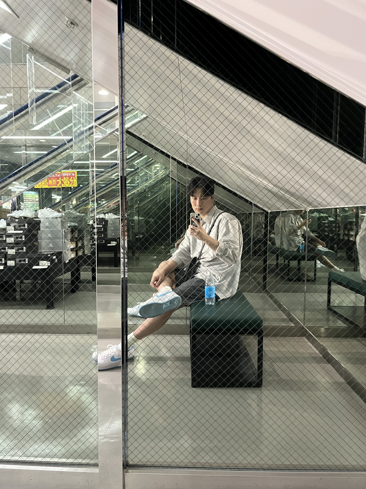

# 이우람

## 0. 대표 이미지

## 1. 경력&경험

### 🎯 관심 도메인

**|** (*예시) 핀테크, 커머스, 고가용성 아키텍처, 데이터 엔지니어링 등*

- 경험해보지 못한 모든 직무

### 🚀 기존 경험 (실무/프로젝트)

| 어떤 경험이던 좋아요! 내가 해왔던 것 중에 공유하고 싶은 것을 얘기해주세요:)

- **[프로젝트 명/회사 명]** (202X.XX - 202X.XX)
    - 주요 역할: (예: API 설계 및 DB 최적화)
    - 성과: (예: 응답 속도 30% 개선, 배포 자동화 구축)

### 🛠 기술 스택

| 없어도 괜찮아요! 가지고 있다면 작성해주세요

- **Main:** (예: Java, Spring Boot, MySQL)
- **Sub:** (예: Python, Redis, Docker)
- **Learning:** (예: Go, Kubernetes)

---

## 2. 자기 소개

### 🧠 MBTI

- ISFJ

### 💬 나만의 소통 방식

-

### ⏰ 에너지 가동 시간 (Work-Log)

| 해당하는 항목에 색칠로 표시해주세요

- 🌅 얼리버드 엔진 (오전 집중형: 해 뜨면 코딩 시작)
- ☀️ 미드데이 부스터 (낮 시간 집중형: 점심 먹고 최고조)
- 🌆 노을빛 워커 (오후~저녁 집중형: 퇴근 시간 전 무서운 속도)
- 🌑 심야의 코딩술사 (새벽형: 모두가 잠든 뒤 뇌가 깨어남)

### 🔍 리뷰 스타일 (Code Review)

| 해당하는 항목에 색칠로 표시해주세요

- 꼼꼼한 현미경파: 오타부터 아키텍처까지 세밀하게 리뷰
- 핵심 짚어주기파: 큰 로직의 흐름과 성능 위주 리뷰
- 부드러운 응원파: 칭찬과 함께 개선안을 조심스럽게 제안
- 효율 우선파: 빠르게 머지하고 실행하며 고치는 스타일

### ⚖️ 갈등 해결 방식

| 해당하는 항목에 색칠로 표시해주세요

- 데이터 팩트폭격기: 수치와 논문, 공식 문서 근거로 해결
- 평화 유지군: 서로의 의견을 절충하여 제3의 안 도출
- 직진 토론러: 감정 빼고 끝까지 토론해서 결론 도출
- 유연한 수용자: 팀의 방향성에 맞춰 빠르게 내 의견 수정 가능

---

## 3. 관심사

- 취미:

| 운동, 게임, 독서

- 관심사:

| 재테크, 태권도, 배드민턴, 클라이밍, 자기개발

- TMI:

| 어떤 얘기라도 좋아요! 내가 가진 TMI 중에 공유하고 싶은 것을 얘기해주세요:)

---

## 4. 백엔드 개발자로서 성장하는 나에게 한마디🔥
모르는것을 부끄러워하지말고 알려고 하지 않는것을 부끄러워하자!